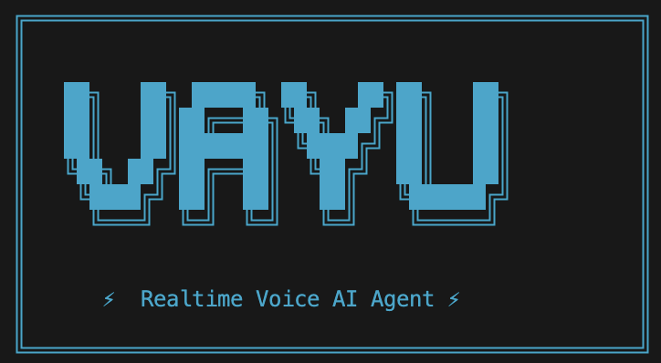

# Vayu Voice AI 🎤⚡

**Vayu** is a real-time voice AI assistant that lets you have natural conversations with an AI. Just speak, and it responds with natural-sounding voice like talking to a friend who happens to know everything.

  

<p align="center">
  
</p>


---

## ✨ Features

- **100% Local Speech Processing** - Your voice never leaves your machine (STT + TTS run locally)
- **Natural Conversations** - Speak naturally, pause to think, and continue—smart pause detection waits for you
- **Real-time Streaming** - Hear responses as they're generated, not after a long wait
- **Barge-in Support** - Interrupt the AI mid-sentence if you need to
- **Pleasant Audio Cues** - A gentle chime indicates when the AI is about to respond
- **Interactive Voice Selection** - Choose from multiple high-quality voices on startup
- **Echo Cancellation** - Novel voice fingerprinting prevents the AI from hearing itself

---

## 🏗️ Architecture

Vayu uses an **Actor Model** with three concurrent pipelines for ultra-low latency:

```
┌─────────────────────────────────────────────────────────────────┐
│                        VAYU ARCHITECTURE                        │
├─────────────────────────────────────────────────────────────────┤
│                                                                 │
│   ┌─────────┐    ┌─────────┐    ┌─────────┐    ┌─────────┐     │
│   │   MIC   │───▶│   VAD   │───▶│   STT   │───▶│  QUEUE  │     │
│   │ (Input) │    │(Silero) │    │(Whisper)│    │         │     │
│   └─────────┘    └─────────┘    └─────────┘    └────┬────┘     │
│                                                      │          │
│                      LOOP 1: Audio → Text            │          │
│   ─────────────────────────────────────────────────────────     │
│                                                      │          │
│                                                      ▼          │
│                                                ┌─────────┐      │
│                                                │   LLM   │      │
│                                                │(OpenRtr)│      │
│                                                └────┬────┘      │
│                                                     │           │
│                      LOOP 2: Text → Response        │           │
│   ─────────────────────────────────────────────────────────     │
│                                                     │           │
│   ┌─────────┐    ┌─────────┐    ┌─────────┐        │           │
│   │ SPEAKER │◀───│   TTS   │◀───│  QUEUE  │◀───────┘           │
│   │(Output) │    │(Kokoro) │    │         │                    │
│   └─────────┘    └─────────┘    └─────────┘                    │
│                                                                 │
│                      LOOP 3: Response → Audio                   │
└─────────────────────────────────────────────────────────────────┘
```

### Why This Design is Efficient

| Feature | Benefit |
|---------|---------|
| **3 Async Loops** | Each stage runs independently. LLM can generate while TTS is speaking |
| **Queue-based Communication** | Loops don't wait for each other; data flows through queues |
| **Streaming Everything** | LLM streams tokens → TTS streams audio → You hear words as they're generated |
| **Local STT/TTS** | No network latency for speech processing |
| **Smart VAD** | Learns your speaking pattern, waits longer when you pause and resume |

---

## 📦 Project Structure

```
voice agent/
├── main.py                 # Entry point
├── config.py               # All configuration in one place
├── setup_models.py         # Download required AI models
├── requirements.txt        # Python dependencies
├── models/                 # AI models (downloaded automatically)
│   ├── faster-whisper-tiny.en/
│   ├── kokoro-v0_19.onnx
│   └── voices.npz
└── src/
    ├── orchestrator.py     # Main brain - coordinates all 3 loops
    ├── interfaces.py       # Abstract interfaces (Strategy Pattern)
    ├── services/
    │   ├── audio_manager.py    # Microphone, speaker, VAD
    │   ├── stt_service.py      # Speech-to-Text (Whisper)
    │   ├── tts_service.py      # Text-to-Speech (Kokoro)
    │   └── llm_service.py      # LLM via OpenRouter
    └── utils/
        ├── voice_fingerprint.py  # Echo detection
        └── sound_effects.py      # Chime sounds
```

---

## 🚀 Quick Start

### Prerequisites

- **Python 3.10+** 
- **Microphone** (built-in or external)
- **OpenRouter API Key** ([Get one free](https://openrouter.ai/))

### Step 1: Clone or Download

```bash
cd ~/Desktop
git clone [<your-repo> "voice agent"](https://github.com/vikramlingam/vayu)
cd vayu
```

### Step 2: Create Virtual Environment

```bash
python3 -m venv venv
source venv/bin/activate  # On Windows: venv\Scripts\activate
```

### Step 3: Install Dependencies

```bash
pip install -r requirements.txt
```

### Step 4: Download AI Models

```bash
python setup_models.py
```

This downloads:
- **Whisper Tiny.en** (~75MB) - for speech recognition
- **Kokoro ONNX** (~350MB) - for text-to-speech

### Step 5: Set Your API Key

Create a `.env` file:

```bash
echo "OPENROUTER_API_KEY=sk-or-v1-your-key-here" > .env
```

### Step 6: Run!

```bash
python main.py
```

You'll see:

```
🎤 Select a Voice:
──────────────────────────────
 1. af_bella *
 2. af_sarah
 ...
──────────────────────────────
Enter number (default: af_bella): 

🎤 Vayu is now listening...
   Speak naturally. Press Ctrl+C to stop.
```

**Just start talking!**

---

## 🎯 How to Use

### Basic Conversation

1. **Speak** - Say anything naturally
2. **Pause** - Wait 1.5 seconds (or longer if you've been speaking a lot)
3. **Listen** - You'll hear a chime, then Vayu responds

### Smart Pause Detection

The system learns from your speaking pattern:

| Behavior | What Happens |
|----------|--------------|
| Quick command | 1.5s pause triggers response |
| Long explanation with pauses | System detects you're still thinking and waits longer |
| Pause and resume multiple times | Each resume adds +0.8s to the threshold (up to 3.5s max) |

### Example Session

```
👤 You: Tell me about the solar system.

🤖 Vayu: The solar system has eight planets orbiting the sun...

👤 You: What about Pluto?

🤖 Vayu: Pluto was reclassified as a dwarf planet in 2006...
```

---

## ⚙️ Configuration

All settings are in `config.py`:

### Voice Activity Detection

```python
VAD_MIN_SILENCE_MS = 1500   # Base pause threshold (1.5s)
VAD_MAX_SILENCE_MS = 3500   # Maximum pause threshold (3.5s)
VAD_RESUME_BONUS_MS = 800   # Extra time per pause-resume
```

### LLM Settings

```python
LLM_MODEL = "sao10k/l3-lunaris-8b"  # Change to any OpenRouter model
LLM_MAX_TOKENS = 1024
LLM_TEMPERATURE = 0.7
```

### TTS Voice

```python
TTS_VOICE = "af_bella"  # Available: af_bella, af_sarah, am_michael, etc.
TTS_SPEED = 1.0         # 0.5 = slower, 2.0 = faster
```

---

## 🔧 Troubleshooting

### "No speech detected"

- Check your microphone is working
- Speak louder or move closer
- Increase `VAD_THRESHOLD` in config (default: 0.6)

### Audio sounds choppy

- Close other audio applications
- Try a different microphone

### LLM taking too long

- Switch to a faster models that has low latency
- Reduce `LLM_MAX_TOKENS`

### Error: OPENROUTER_API_KEY not found

- Make sure `.env` file exists in the project root
- Check the key format: `OPENROUTER_API_KEY=sk-or-v1-xxxxx`

---

## 🧠 Technical Details

### Services

| Service | Technology | Where It Runs |
|---------|------------|---------------|
| STT (Speech-to-Text) | faster-whisper tiny.en | Local (CPU) |
| TTS (Text-to-Speech) | kokoro-onnx | Local (CPU) |
| VAD (Voice Detection) | Silero VAD | Local (CPU) |
| LLM (Language Model) | OpenRouter API | Cloud |

### Echo Cancellation

Vayu uses **MFCC Voice Fingerprinting** to prevent hearing itself:

1. Before playing audio, store its spectral fingerprint
2. When microphone captures audio during playback, compare fingerprints
3. If similarity > 50%, it's echo—ignore it
4. If different, it's the user speaking—process it

---

## 📄 License

MIT License - Use freely, modify as needed.

---

## 🙏 Acknowledgments

- [faster-whisper](https://github.com/SYSTRAN/faster-whisper) - Fast Whisper implementation
- [kokoro-onnx](https://github.com/thewh1teagle/kokoro-onnx) - High-quality TTS
- [Silero VAD](https://github.com/snakers4/silero-vad) - Accurate voice detection
- [OpenRouter](https://openrouter.ai/) - Access to multiple LLMs

---
